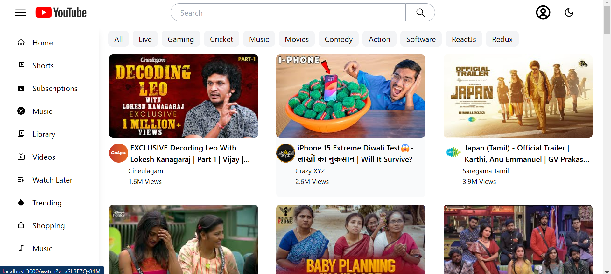
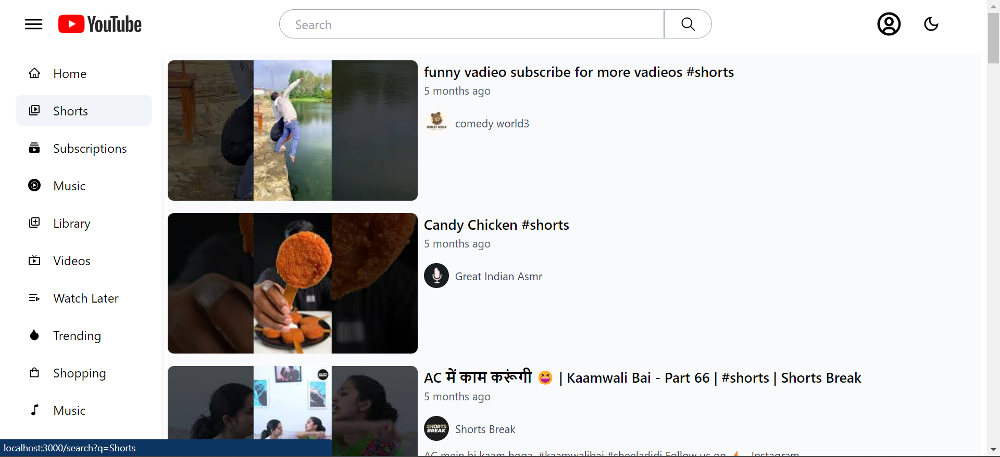
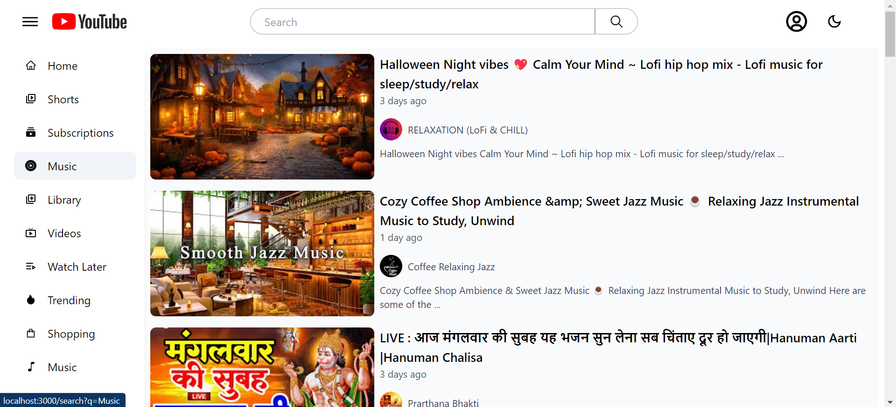
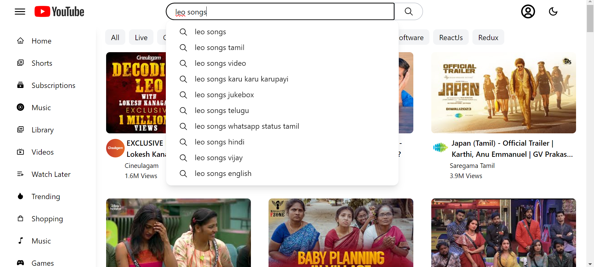
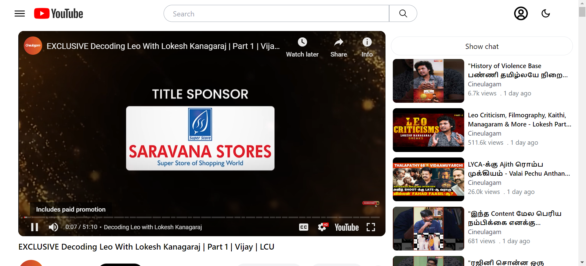

# YouTube Clone with React and Redux Toolkit

This project is a YouTube clone built using React and Redux Toolkit. It replicates many of the features you'd find on the YouTube platform.

## Project Overview

### Technologies Used

- React: Used as the primary front-end library.
- Redux Toolkit: For state management.
- React Router: For routing within the application.
- Parcel: The bundler used for the project.
- Babel: As the transcompiler for modern JavaScript.

### Project Structure

The project's codebase is organized as follows:

- `src/`: This directory contains the source code for the project.

  - `components/`: Various components used in the project, each documented with comments explaining its functionality.
  - `App.js`: The main application component.
  - `index.js`: The entry point of the application.

## Getting Started

To run this project locally, follow these steps:

1. Clone the repository to your local machine.
2. Navigate to the project directory.
3. Install the required dependencies using `npm install`.
4. Start the development server with `npm start`.

This will launch the application locally for testing and development.

## Functionality of the App

### Home Page

### Home Page in Dark Mode

### Toggling Side Bar by Clicking on Toggler

### Clicking on Shorts in Side Bar

### Clicking on Music in Side Bar

### Enabling Infinite Scroll While Scrolled Down

### Search Suggestions While Entering Data in the Search Bar

### Search Results Page

### Watch Page and Recommendations - When Clicked on a Video

### Watch Page Video Details and Recommendations

### Live Chat When Clicked on Show Chat

## Contributions

We welcome contributions to this project. If you have ideas for improvements or find any issues, please open an issue or submit a pull request.

## Google API Key
To obtain a Google API Key for this project, follow these steps:

1. Go to the Google Developer Console.
2. Create a new project.
3. Manage API's and enable the required APIs for your project.
4. Create credentials to obtain the API key.

## Redux Toolkit

- **Updating Data:** To update the data in a Slice of an App store, we dispatch an action using a dispatcher, which, in turn, calls a function to update the slice.

- **Subscribing to Store:** We subscribe to the store to get the updated data within no time using `useSelector`.
